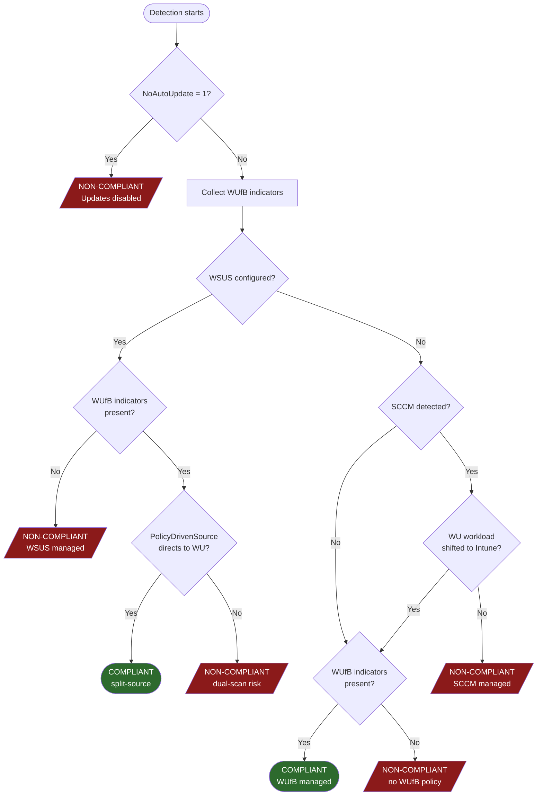

# WUDUP Proactive Remediation

Intune Proactive Remediation script pair for ensuring devices are managed by Windows Update for Business (WUfB).

- **`WUDUP-Detect.ps1`** — detection script (exit 0 = compliant, exit 1 = non-compliant)
- **`WUDUP-Remediate.ps1`** — remediation script (removes blockers so WUfB policy can take effect)

Both scripts run as SYSTEM, are non-interactive, and log to `%ProgramData%\WUDUP\Logs\`.

## Detection Flow



## Detection Details

### 1. Blocker Checks (checked first, immediate non-compliant)

| Check | Condition | Why it fails |
|-------|-----------|-------------|
| Auto-updates disabled | `NoAutoUpdate = 1` in AU subkey | Updates are disabled entirely — WUfB policies cannot take effect |

### 2. WUfB Indicator Collection

The script collects indicators that the device is managed by WUfB. Any indicator present means WUfB may be active.

| Indicator | Registry values checked | Path priority |
|-----------|----------------------|---------------|
| Policy-driven update source | `SetPolicyDrivenUpdateSourceForFeatureUpdates` (value 0 = WU) | GP then MDM |
| | `SetPolicyDrivenUpdateSourceForQualityUpdates` (value 0 = WU) | GP then MDM |
| | `SetPolicyDrivenUpdateSourceForDriverUpdates` (value 0 = WU) | GP then MDM |
| | `SetPolicyDrivenUpdateSourceForOtherUpdates` (value 0 = WU) | GP then MDM |
| Feature deferral | `DeferFeatureUpdatesPeriodInDays` | GP then MDM |
| Quality deferral | `DeferQualityUpdatesPeriodInDays` | GP then MDM |
| Version targeting | `TargetReleaseVersion = 1` + `TargetReleaseVersionInfo` + `ProductVersion` | GP then MDM |
| Feature deadline | `ConfigureDeadlineForFeatureUpdates` at GP then MDM; fallback to `ComplianceDeadlineForFU` at GP | GP then MDM |
| Quality deadline | `ConfigureDeadlineForQualityUpdates` at GP then MDM; fallback to `ComplianceDeadline` at GP | GP then MDM |
| Grace period | `ConfigureDeadlineGracePeriod` at GP then MDM; fallback to `ComplianceGracePeriod` at GP | GP then MDM |
| Grace period (feature) | `ConfigureDeadlineGracePeriodForFeatureUpdates` at GP then MDM; fallback to `ComplianceGracePeriodForFU` at GP | GP then MDM |
| Channel targeting | `BranchReadinessLevel` | GP then MDM |
| Preview build management | `ManagePreviewBuilds` | GP then MDM |
| Driver exclusion | `ExcludeWUDriversInQualityUpdate` | GP then MDM |

### 3. Management Authority Detection

| Authority | How detected |
|-----------|-------------|
| WSUS | `UseWUServer = 1` (AU subkey) AND `WUServer` exists (WU key) |
| SCCM | `ccmexec` service running AND `HKLM:\SOFTWARE\Microsoft\CCM` exists. Co-management check: if `CoManagementFlags` value 16 (bit position 4) is set, the WU workload is considered shifted to Intune and SCCM is cleared — device evaluated for WUfB indicators instead. |

### 4. Compliance Decision

| Scenario | Result | Exit |
|----------|--------|------|
| WUfB indicators present, no WSUS | **Compliant** | 0 |
| WUfB indicators present + WSUS, but PolicyDrivenSource directs updates to WU | **Compliant** (split-source) | 0 |
| WSUS + WUfB indicators, but no PolicyDrivenSource override | **Non-compliant** (dual-scan risk) | 1 |
| WSUS configured, no WUfB indicators | **Non-compliant** (WSUS managed) | 1 |
| SCCM detected, WU workload not shifted to Intune | **Non-compliant** (SCCM managed) | 1 |
| SCCM co-managed, WU workload shifted to Intune, but no WUfB indicators | **Non-compliant** (no WUfB policy) | 1 |
| No indicators, no WSUS, no SCCM | **Non-compliant** (no policy, default WU) | 1 |

### Registry Paths

| Path | Purpose |
|------|---------|
| `HKLM:\SOFTWARE\Policies\Microsoft\Windows\WindowsUpdate` | Group Policy WU settings |
| `HKLM:\SOFTWARE\Policies\Microsoft\Windows\WindowsUpdate\AU` | Group Policy Automatic Updates settings |
| `HKLM:\SOFTWARE\Microsoft\PolicyManager\current\device\Update` | MDM/Intune policy settings |

## Remediation Actions

The remediation script **only removes blockers** — it does not set update policies (deferrals, deadlines, version pins, etc.). Those should come from your Intune WUfB Update Ring assignment.

| Step | Action | Details |
|------|--------|---------|
| 0 | SCCM guard | Skips if SCCM manages WU workload and co-management hasn't shifted it to Intune (`CoManagementFlags` value 16, bit position 4) |
| 1 | Remove WSUS config | `WUServer`, `WUStatusServer`, `DoNotConnectToWindowsUpdateInternetLocations`, `SetDisableUXWUAccess`, `UpdateServiceUrlAlternate`, `UseWUServer` |
| 2 | Set PolicyDrivenSource | All 4 update types set to 0 (Windows Update) + `UseUpdateClassPolicySource = 1` |
| 3 | Remove NoAutoUpdate | Removes `NoAutoUpdate = 1` if set |
| 4 | Clean stale pauses | `PauseFeatureUpdates`, `PauseQualityUpdates` + their start/end timestamps |
| 5 | Trigger policy scan | `usoclient StartScan` (non-fatal if unavailable) |

## Configuration

```powershell
$Config_AllowOnSCCM = $false   # $true to force remediation on SCCM-managed devices
```

## Deployment in Intune

1. Navigate to **Devices > Remediations** (or **Proactive remediations**)
2. Create a new remediation script package
3. Upload `WUDUP-Detect.ps1` as the detection script
4. Upload `WUDUP-Remediate.ps1` as the remediation script
5. Set **Run this script using the logged-on credentials** to **No** (runs as SYSTEM)
6. Assign to your target device groups

## Logging

Both scripts log to `%ProgramData%\WUDUP\Logs\`:
- `detect.log` — detection results with timestamps
- `remediate.log` — remediation actions with timestamps

Logs are append-only and persist across runs for troubleshooting.
