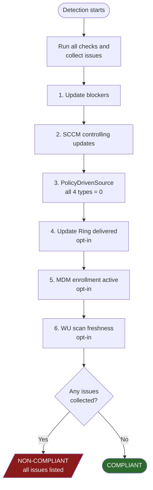

# WUDUP Proactive Remediation

Intune Proactive Remediation script pair for ensuring devices are managed by Windows Update for Business (WUfB).

- **`WUDUP-Detect.ps1`** — detection script (exit 0 = compliant, exit 1 = non-compliant)
- **`WUDUP-Remediate.ps1`** — remediation script (removes blockers so WUfB policy can take effect)

Both scripts run as SYSTEM, are non-interactive, and log to `%ProgramData%\WUDUP\Logs\`.

The detection script answers a single question: *"Does this device have all the necessary settings so that Intune WUfB can manage ALL updates?"* It does **not** validate update policy values themselves (deferrals, deadlines, version pins) — those should come from your Intune Update Ring assignment and are surfaced as informational output only.

## Detection Flow



The script does **not** short-circuit on the first failure. Every check runs, every issue is collected into a single list, and one structured report is emitted at the end. This means a non-compliant device's report shows the complete picture (all blockers, all missing PolicyDrivenSource keys, health failures) in a single Intune run.

## Detection Details

### 1. Update blockers

Each blocker is checked individually and emits a `[PASS]`/`[FAIL]` line in the output (with the registry path on fail).

| Check | Condition | Why it fails |
|-------|-----------|-------------|
| Auto-updates disabled | `NoAutoUpdate = 1` in AU subkey | Updates are disabled entirely |
| Never check | `AUOptions = 1` in AU subkey | WU client will never check for updates |
| Internet WU blocked | `DoNotConnectToWindowsUpdateInternetLocations = 1` in WU key | Device cannot reach Windows Update servers |
| WU UI/access disabled | `SetDisableUXWUAccess = 1` in WU key | WU access hidden/blocked |
| All WU features disabled | `DisableWindowsUpdateAccess = 1` in WU key | All Windows Update features turned off (Microsoft Autopatch checks this specifically) |
| MDM auto-update disabled | `AllowAutoUpdate = 5` in MDM Update key | Auto updates disabled via Intune/MDM policy — **cannot be auto-remediated** |
| MDM update service blocked | `AllowUpdateService = 0` in MDM Update key | All update services blocked via Intune/MDM policy — **cannot be auto-remediated** |
| WU service disabled | `wuauserv` StartType = `Disabled` | Windows Update service won't run |
| USO service disabled | `UsoSvc` StartType = `Disabled` | Update Orchestrator won't run |
| Orphaned WSUS pointer | `UseWUServer = 1` (AU) but `WUServer` empty/null | WU client points at no server |

### 2. SCCM check

| Check | Detected when | Resolution |
|-------|--------------|------------|
| SCCM controlling updates | `ccmexec` service exists AND `HKLM:\SOFTWARE\Microsoft\CCM` exists | If `CoManagementFlags` value 16 (bit position 4) is set, the WU workload has shifted to Intune and SCCM is cleared. Otherwise, SCCM is reported as a blocker for WUfB. |

### 3. PolicyDrivenSource (the core compliance gate)

All four `SetPolicyDrivenUpdateSourceFor{Feature,Quality,Driver,Other}Updates` values must equal `0` (= Windows Update). This is checked at GP and MDM paths separately — either path having `0` is sufficient (MDM-delivered values override GP on the WU client).

| Update type | GP path value | MDM path value |
|-------------|---------------|----------------|
| Feature | `SetPolicyDrivenUpdateSourceForFeatureUpdates` | same name |
| Quality | `SetPolicyDrivenUpdateSourceForQualityUpdates` | same name |
| Driver  | `SetPolicyDrivenUpdateSourceForDriverUpdates`  | same name |
| Other   | `SetPolicyDrivenUpdateSourceForOtherUpdates`   | same name |

A missing value is treated the same as a wrong value: non-compliant. All four must pass.

WSUS configuration (`WUServer`/`UseWUServer`) is **not** itself a compliance gate. If WSUS is configured but all four PolicyDrivenSource keys = 0, the device is compliant (the WSUS pointer is stale and surfaced as a note, not an issue). If WSUS is configured AND any PolicyDrivenSource key is wrong, the WSUS server name is appended to the issue list as context.

### 4. Management channel health checks (opt-in)

These run for every device — they are collected as part of the same issue list as the gates above and are not gated behind the configuration checks. Each can be disabled independently via the configuration flags at the top of the script.

| Check | Config flag | What it validates |
|-------|-------------|-------------------|
| Update Ring delivery | `$Config_RequireUpdateRing` | At least one MDM enrollment with provider `MS DM Server` or `WMI_Bridge_SCCM_Server` has WUfB-specific values present in `PolicyManager\Providers\<GUID>\default\device\Update`. This distinguishes a real Intune Update Ring from PolicyDrivenSource keys that the remediation script just wrote. |
| MDM enrollment health | `$Config_RequireMDMEnrollment` | An enrollment exists with `EnrollmentState = 1` and a recognized ProviderID. |
| WU scan freshness | `$Config_MaxScanAgeDays` | The WU client has scanned within N days. Source priority: `Microsoft.Update.AutoUpdate` COM (`LastSearchSuccessDate`) → `Microsoft.Update.Session` history → legacy `Auto Update\Results\Detect\LastSuccessTime` registry. |

**Remediation cannot fix any of these conditions.** Failures point to manual action (re-enroll the device, investigate the WU client, or assign an Update Ring in Intune).

Recognized MDM provider IDs:
- `MS DM Server` — direct Intune enrollment
- `WMI_Bridge_SCCM_Server` — SCCM co-management bridge

### 5. Compliance decision

The script collects every issue from sections 1–4 into a single list, then:

| Outcome | Condition | Exit |
|---------|-----------|------|
| **COMPLIANT** | Issue list is empty | 0 |
| **NON-COMPLIANT** | Issue list has any entries | 1 |
| **ERROR** | Unhandled exception during detection | 1 |

A compliant exit may still include a note line if a stale WSUS server is configured but fully overridden by PolicyDrivenSource keys.

## Output Format

Every run produces a structured multi-section report (built by `Format-Output`) which Intune captures and displays in the device's remediation history. The exit code is what Intune actually uses for compliance — the text is for admins reading the report.

Sections (in order):

1. **Header** — `=== WUDUP Detection ===` and a one-line `RESULT — reason`
2. **Checks Performed** — every blocker/SCCM/PolicyDrivenSource/health check as a `[PASS]`/`[FAIL]`/`[SKIP]` line, with the registry path shown beneath any `[FAIL]`
3. **Issues Found** *(non-compliant only)* — human-readable list of what's wrong
4. **Remediation** *(non-compliant only)* — what to do, including notes when MDM-delivered blockers can't be auto-fixed
5. **Management Channel** — health summary block:
   - `Update Ring: Active | Not detected`
   - `MDM: Enrolled via {Intune direct | Co-management bridge} ({UPN}) | Not enrolled`
   - `Last WU scan: N days ago | Unknown`
   - `Last install: yyyy-MM-dd HH:mm` (when known)
   - `Pending reboot: Yes | No`
   - `DO Mode: 100 (Bypass)` warning (only if mode 100 is set — deprecated on Windows 11)
   - `cryptsvc: Disabled` and `TrustedInstaller: Disabled` warnings (only if disabled)
6. **WUfB Policy** — informational dump of policy values delivered to the device (see next section). Header changes to `WUfB Policy (delivered but not effective — issues must be resolved first)` when the result is non-compliant.

### Informational policy indicators (not gates)

These values are read and displayed for context but **never affect compliance**. Values come from `Get-PolicyValue` (GP path first, MDM fallback) unless noted.

| Indicator | Source / notes |
|-----------|---------------|
| Feature deferral | `DeferFeatureUpdatesPeriodInDays`. Warns if `DeferFeatureUpdates` enable flag = 0 alongside a non-zero period. |
| Quality deferral | `DeferQualityUpdatesPeriodInDays`. Warns if `DeferQualityUpdates` enable flag = 0 alongside a non-zero period. |
| Version target | Handles **both** formats: GP uses `TargetReleaseVersion = 1` (DWORD enable flag) + `TargetReleaseVersionInfo` (string); MDM uses `TargetReleaseVersion` as the version string itself. `ProductVersion` is prepended when present. |
| Feature deadline | `ConfigureDeadlineForFeatureUpdates` at GP, then `ComplianceDeadlineForFU` at GP, then `ConfigureDeadlineForFeatureUpdates` at MDM |
| Quality deadline | `ConfigureDeadlineForQualityUpdates` at GP, then `ComplianceDeadline` at GP, then `ConfigureDeadlineForQualityUpdates` at MDM |
| Grace period | `ConfigureDeadlineGracePeriod` at GP, then `ComplianceGracePeriod` at GP, then `ConfigureDeadlineGracePeriod` at MDM |
| Grace period (feature) | `ConfigureDeadlineGracePeriodForFeatureUpdates` at GP, then `ComplianceGracePeriodForFU` at GP, then `ConfigureDeadlineGracePeriodForFeatureUpdates` at MDM |
| Update channel | `BranchReadinessLevel` (2 = GA, 4 = Preview, 8 = Insider Slow, 16 = Semi-Annual Channel) |
| Preview builds | `ManagePreviewBuilds` (2 = Enabled, otherwise Disabled) |
| Driver updates | `ExcludeWUDriversInQualityUpdate` |

## Registry paths read

| Path | Purpose |
|------|---------|
| `HKLM:\SOFTWARE\Policies\Microsoft\Windows\WindowsUpdate` | Group Policy WU settings |
| `HKLM:\SOFTWARE\Policies\Microsoft\Windows\WindowsUpdate\AU` | Group Policy Automatic Updates settings |
| `HKLM:\SOFTWARE\Microsoft\PolicyManager\current\device\Update` | MDM/Intune policy settings |
| `HKLM:\SOFTWARE\Microsoft\PolicyManager\Providers\{GUID}\default\device\Update` | Per-provider MDM policy delivery (Update Ring detection) |
| `HKLM:\SOFTWARE\Microsoft\Enrollments\{GUID}` | MDM enrollment state and ProviderID |
| `HKLM:\SOFTWARE\Microsoft\CCM` (incl. `CoManagementFlags`) | SCCM presence and co-management workload bitmask |
| `HKLM:\SOFTWARE\Policies\Microsoft\Windows\DeliveryOptimization` | DO mode (GP, value `DownloadMode`) |
| `HKLM:\SOFTWARE\Microsoft\PolicyManager\current\device\DeliveryOptimization` | DO mode (MDM, value `DODownloadMode`) |
| `HKLM:\SOFTWARE\Microsoft\Windows\CurrentVersion\WindowsUpdate\Auto Update\Results\Detect` | Legacy WU scan timestamp fallback |
| `HKLM:\SOFTWARE\Microsoft\Windows\CurrentVersion\WindowsUpdate\Auto Update\RebootRequired` | Pending reboot indicator |
| `HKLM:\SOFTWARE\Microsoft\Windows\CurrentVersion\Component Based Servicing\RebootPending` | Pending reboot indicator |

COM objects used: `Microsoft.Update.AutoUpdate` (scan/install timestamps), `Microsoft.Update.Session` (history fallback), `Microsoft.Update.SystemInfo` (authoritative pending-reboot).

## Remediation Actions

The remediation script **only removes blockers and resets WU client state** — it does not set update policies (deferrals, deadlines, version pins). Those should come from your Intune WUfB Update Ring assignment.

| Step | Action | Details |
|------|--------|---------|
| 0   | SCCM guard | If `ccmexec` + `HKLM:\SOFTWARE\Microsoft\CCM` exist and `CoManagementFlags` bit 4 (value 16) is **not** set, exits SKIPPED with exit code 1 — unless `$Config_AllowOnSCCM = $true`, in which case it continues with a warning entry in the change list. Co-managed devices (bit 4 set) continue normally. |
| 0b  | MDM blocker warnings | If MDM `AllowAutoUpdate = 5` or `AllowUpdateService = 0` is set, appends a warning to the change list — these cannot be fixed locally; the Intune device configuration profile must be reviewed. |
| 1   | Stop WU services | Stops `wuauserv`, `bits`, `UsoSvc` to prevent cached in-memory state from overriding registry changes |
| 2   | Remove WSUS config | Deletes `WUServer`, `WUStatusServer`, `DoNotConnectToWindowsUpdateInternetLocations`, `SetDisableUXWUAccess`, `DisableWindowsUpdateAccess`, `UpdateServiceUrlAlternate`, `UseWUServer` |
| 3   | Set PolicyDrivenSource | All 4 update types set to `0` (Windows Update) + `UseUpdateClassPolicySource = 1` in AU subkey (required for direct registry writes; GPO/CSP set this automatically) |
| 4   | Remove update-disabling values | Deletes `NoAutoUpdate = 1` and `AUOptions = 1` if set |
| 5   | Clean stale pauses | Removes `PauseFeatureUpdates`, `PauseQualityUpdates` enable flags + their `*StartTime` / `*EndTime` timestamps |
| 6   | Clear UpdatePolicy cache | Deletes `HKLM:\SOFTWARE\Microsoft\WindowsUpdate\UpdatePolicy` — the WU client's resolved-policy cache. Stale entries here cause the client to ignore new policy. Intune re-sync rebuilds it. Critical for fixing "Offer Ready" stalls. |
| 7   | Clear SoftwareDistribution | Deletes `%SystemRoot%\SoftwareDistribution` to force a fresh scan database. Services must be stopped first (step 1) or files lock. |
| 8   | Re-enable WU services | Sets `wuauserv` and `UsoSvc` to `Manual` startup if currently `Disabled` |
| 9   | Start services + re-sync | Starts `wuauserv`, `bits`, `UsoSvc`; triggers the Intune `PushLaunch` scheduled task to force policy re-delivery; runs `usoclient StartScan` |

Output is a structured `=== WUDUP Remediation ===` block with `REMEDIATED` / `SKIPPED` / `ERROR`, a reason line, and the change list.

## Configuration

```powershell
# --- WUDUP-Detect.ps1 ---
$Config_RequireUpdateRing    = $true   # Require Intune Update Ring delivering WUfB policy
$Config_RequireMDMEnrollment = $true   # Require active MDM enrollment (EnrollmentState=1)
$Config_MaxScanAgeDays       = 7       # Max days since last WU scan (0 = disabled)

# --- WUDUP-Remediate.ps1 ---
$Config_AllowOnSCCM          = $false  # $true to force remediation on SCCM-managed devices
```

## Deployment in Intune

1. Navigate to **Devices > Remediations** (or **Proactive remediations**)
2. Create a new remediation script package
3. Upload `WUDUP-Detect.ps1` as the detection script
4. Upload `WUDUP-Remediate.ps1` as the remediation script
5. Set **Run this script using the logged-on credentials** to **No** (runs as SYSTEM)
6. Assign to your target device groups

## Logging

Both scripts log to `%ProgramData%\WUDUP\Logs\`:
- `detect.log` — detection results with timestamps
- `remediate.log` — remediation actions with timestamps

Logs are append-only and persist across runs for troubleshooting.
