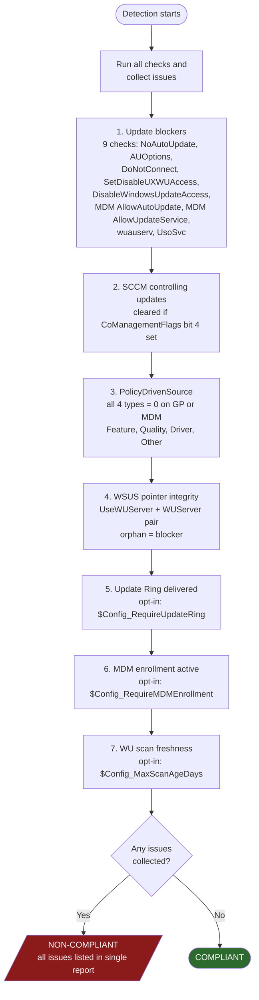

# WUDUP Proactive Remediation — Technical Reference

Deep reference documentation for `WUDUP-Detect.ps1` and `WUDUP-Remediate.ps1`. For an overview, deployment instructions, and example output, see [README.md](README.md).

## Contents

- [Detection flow](#detection-flow)
- [Detection checks (in order)](#detection-checks-in-order)
  - [1. Update blockers](#1-update-blockers)
  - [2. SCCM check](#2-sccm-check)
  - [3. PolicyDrivenSource (the core compliance gate)](#3-policydrivensource-the-core-compliance-gate)
  - [4. WSUS pointer integrity](#4-wsus-pointer-integrity)
  - [5. Opt-in health checks](#5-opt-in-health-checks)
- [Compliance decision](#compliance-decision)
- [Output format spec](#output-format-spec)
- [Informational policy indicators (not gates)](#informational-policy-indicators-not-gates)
- [Registry paths and APIs](#registry-paths-and-apis)
- [Remediation actions](#remediation-actions)
- [Color rendering and Intune compatibility](#color-rendering-and-intune-compatibility)

---

## Detection flow

The script does **not** short-circuit on the first failure. Every check runs, every issue is collected, and one structured report is emitted at the end. A non-compliant device's report shows the complete picture (every blocker, every missing PolicyDrivenSource key, every health failure) in a single Intune run.

---

## Detection checks (in order)

Each check emits a numbered `[NN] [PASS|FAIL|SKIP]` line with current value, expected value, and registry path.

### 1. Update blockers

| # | Check | Condition | Why it fails |
|---|-------|-----------|-------------|
| 01 | Auto-updates disabled | `NoAutoUpdate = 1` in AU subkey | Updates are disabled entirely |
| 02 | Never check | `AUOptions = 1` in AU subkey | WU client will never check for updates |
| 03 | Internet WU blocked | `DoNotConnectToWindowsUpdateInternetLocations = 1` in WU key | Device cannot reach Windows Update servers |
| 04 | WU UI/access disabled | `SetDisableUXWUAccess = 1` in WU key | WU access hidden/blocked |
| 05 | All WU features disabled | `DisableWindowsUpdateAccess = 1` in WU key | All Windows Update features turned off (Microsoft Autopatch checks this specifically) |
| 06 | MDM auto-update disabled | `AllowAutoUpdate = 5` in MDM Update key | Auto updates disabled via Intune/MDM policy — **cannot be auto-remediated** |
| 07 | MDM update service blocked | `AllowUpdateService = 0` in MDM Update key | All update services blocked via Intune/MDM policy — **cannot be auto-remediated** |
| 08 | WU service disabled | `wuauserv` StartType = `Disabled` | Windows Update service won't run |
| 09 | USO service disabled | `UsoSvc` StartType = `Disabled` | Update Orchestrator won't run |

The orphaned WSUS pointer (check 15 in the output) is also a blocker but is described in [section 4](#4-wsus-pointer-integrity) below since it depends on values read after the PolicyDrivenSource section.

### 2. SCCM check

| # | Check | Detected when | Resolution |
|---|-------|--------------|------------|
| 10 | SCCM controlling updates | `ccmexec` service exists AND `HKLM:\SOFTWARE\Microsoft\CCM` exists | If `CoManagementFlags` value 16 (bit position 4) is set, the WU workload has shifted to Intune and SCCM is cleared. Otherwise, SCCM is reported as a blocker for WUfB. |

### 3. PolicyDrivenSource (the core compliance gate)

All four `SetPolicyDrivenUpdateSourceFor{Feature,Quality,Driver,Other}Updates` values must equal `0` (= Windows Update). Each is checked at GP and MDM paths separately — either path having `0` is sufficient (MDM-delivered values override GP on the WU client).

| # | Update type | Value name (same on GP and MDM) |
|---|-------------|---------------------------------|
| 11 | Feature | `SetPolicyDrivenUpdateSourceForFeatureUpdates` |
| 12 | Quality | `SetPolicyDrivenUpdateSourceForQualityUpdates` |
| 13 | Driver  | `SetPolicyDrivenUpdateSourceForDriverUpdates`  |
| 14 | Other   | `SetPolicyDrivenUpdateSourceForOtherUpdates`   |

A missing value is treated the same as a wrong value: non-compliant. All four must pass.

WSUS configuration (`WUServer`/`UseWUServer`) is **not** itself a compliance gate. If WSUS is configured but all four PolicyDrivenSource keys = 0, the device is compliant — the WSUS pointer is stale and is surfaced as a note, not an issue. If WSUS is configured AND any PolicyDrivenSource key is wrong, the WSUS server name is appended to the issue list as context.

### 4. WSUS pointer integrity

| # | Check | Condition | Why it fails |
|---|-------|-----------|-------------|
| 15 | WSUS pointer integrity | `UseWUServer = 1` (AU) but `WUServer` empty/null | WU client points at no server — updates cannot reach any source |

This check evaluates the pair (`UseWUServer`, `WUServer`). They should either both be unset, or both be set together. An orphan (`UseWUServer=1` with no `WUServer`) sets `$hasBlockers = $true` and is reported under the blocker category.

### 5. Opt-in health checks

These run on every device but are gated behind config flags so you can disable them per-environment. Each is collected as a regular issue alongside the gates above — failing one of these is just as non-compliant as failing PolicyDrivenSource.

| # | Check | Config flag | What it validates |
|---|-------|-------------|-------------------|
| 16 | Update Ring delivery | `$Config_RequireUpdateRing` | At least one MDM enrollment with provider `MS DM Server` or `WMI_Bridge_SCCM_Server` has WUfB-specific values present in `PolicyManager\Providers\<GUID>\default\device\Update`. This distinguishes a real Intune Update Ring from PolicyDrivenSource keys that the remediation script just wrote. |
| 17 | MDM enrollment health | `$Config_RequireMDMEnrollment` | An enrollment exists with `EnrollmentState = 1` and a recognized ProviderID. |
| 18 | WU scan freshness | `$Config_MaxScanAgeDays` | The WU client has scanned within N days. Source priority: `Microsoft.Update.AutoUpdate` COM (`LastSearchSuccessDate`) → `Microsoft.Update.Session` history → legacy `Auto Update\Results\Detect\LastSuccessTime` registry. |

**Remediation cannot fix any of these conditions.** Failures point to manual action: re-enroll the device, investigate the WU client, or assign an Update Ring in Intune.

Recognized MDM provider IDs:

- `MS DM Server` — direct Intune enrollment
- `WMI_Bridge_SCCM_Server` — SCCM co-management bridge

---

## Compliance decision

The script collects every issue from sections 1–5 into a single list, then:

| Outcome | Condition | Exit |
|---------|-----------|------|
| **COMPLIANT** | Issue list is empty | 0 |
| **NON-COMPLIANT** | Issue list has any entries | 1 |
| **ERROR** | Unhandled exception during detection | 1 |

A compliant exit may still include a note line if a stale WSUS server is configured but fully overridden by PolicyDrivenSource keys.

---

## Output format spec

The scripts emit **two different output formats** depending on context, controlled by the `$script:IsSystem` flag (the same SID check used for color suppression):

| Context | stdout format | Log file |
|---------|--------------|----------|
| **SYSTEM (Intune Proactive Remediation)** | Minimal (built by `Format-CompactOutput`) — verdict on line 1, then for Detect one line per failed check with the check number; for Remediate, any `WARNING` notes for things that couldn't be auto-fixed. Typically well under 1 KB. | Detect: no log file (read-only). Remediate: full verbose report appended to `remediate.log` |
| **Interactive (local testing)** | Full verbose (built by `Format-Output`) — all 18 checks with current/expected/path, issues, remediation, health, policy indicators. ANSI color enabled. | Same full verbose report appended to log |

The full verbose report is **always** written to the log regardless of stdout format, so the Intune view stays clean while the device retains complete forensic detail. `Write-LogReport` adds a `----- [timestamp] -----` separator before each report so the log is easy to scan when investigating a specific run.

The exit code is what Intune actually uses for compliance — both output formats are for humans reading the report.

### Verbose format (interactive)

Every verbose run produces a structured multi-section report (built by `Format-Output`):

Sections, in order:

1. **Header** — `=== WUDUP Detection ===` and a one-line `RESULT — reason`
2. **Checks Performed** — every blocker / SCCM / PolicyDrivenSource / WSUS / health check as a numbered `[NN] [PASS|FAIL|SKIP]` block, with current value, expected value, and registry path
3. **Issues Found** *(non-compliant only)* — human-readable list of what's wrong
4. **Remediation** *(non-compliant only)* — what to do, including notes when MDM-delivered blockers can't be auto-fixed
5. **Management Channel** — health summary block:
   - `Update Ring: Active | Not detected`
   - `MDM: Enrolled via {Intune direct | Co-management bridge} ({UPN}) | Not enrolled`
   - `Last WU scan: N days ago | Unknown`
   - `Last install: yyyy-MM-dd HH:mm` (when known)
   - `Pending reboot: Yes | No`
   - `DO Mode: 100 (Bypass)` warning (only if mode 100 is set — deprecated on Windows 11)
   - `cryptsvc: Disabled` and `TrustedInstaller: Disabled` warnings (only if disabled)
6. **WUfB Policy** — informational dump of policy values delivered to the device (see next section). Header changes to `WUfB Policy (delivered but not effective — issues must be resolved first)` when the result is non-compliant.

---

## Informational policy indicators (not gates)

These values are read and displayed for context but **never affect compliance**. Values come from `Get-PolicyValue` (GP path first, MDM fallback) unless noted.

| Indicator | Source / notes |
|-----------|---------------|
| Feature deferral | `DeferFeatureUpdatesPeriodInDays`. Warns if `DeferFeatureUpdates` enable flag = 0 alongside a non-zero period. |
| Quality deferral | `DeferQualityUpdatesPeriodInDays`. Warns if `DeferQualityUpdates` enable flag = 0 alongside a non-zero period. |
| Version target | Handles **both** formats: GP uses `TargetReleaseVersion = 1` (DWORD enable flag) + `TargetReleaseVersionInfo` (string); MDM uses `TargetReleaseVersion` as the version string itself. `ProductVersion` is prepended when present. |
| Feature deadline | `ConfigureDeadlineForFeatureUpdates` at GP, then `ComplianceDeadlineForFU` at GP, then `ConfigureDeadlineForFeatureUpdates` at MDM |
| Quality deadline | `ConfigureDeadlineForQualityUpdates` at GP, then `ComplianceDeadline` at GP, then `ConfigureDeadlineForQualityUpdates` at MDM |
| Grace period | `ConfigureDeadlineGracePeriod` at GP, then `ComplianceGracePeriod` at GP, then `ConfigureDeadlineGracePeriod` at MDM |
| Grace period (feature) | `ConfigureDeadlineGracePeriodForFeatureUpdates` at GP, then `ComplianceGracePeriodForFU` at GP, then `ConfigureDeadlineGracePeriodForFeatureUpdates` at MDM |
| Update channel | `BranchReadinessLevel` (2 = GA, 4 = Preview, 8 = Insider Slow, 16 = Semi-Annual Channel) |
| Preview builds | `ManagePreviewBuilds` (2 = Enabled, otherwise Disabled) |
| Driver updates | `ExcludeWUDriversInQualityUpdate` |

---

## Registry paths and APIs

### Paths read by Detect

| Path | Purpose |
|------|---------|
| `HKLM:\SOFTWARE\Policies\Microsoft\Windows\WindowsUpdate` | Group Policy WU settings |
| `HKLM:\SOFTWARE\Policies\Microsoft\Windows\WindowsUpdate\AU` | Group Policy Automatic Updates settings |
| `HKLM:\SOFTWARE\Microsoft\PolicyManager\current\device\Update` | MDM/Intune policy settings |
| `HKLM:\SOFTWARE\Microsoft\PolicyManager\Providers\{GUID}\default\device\Update` | Per-provider MDM policy delivery (Update Ring detection) |
| `HKLM:\SOFTWARE\Microsoft\Enrollments\{GUID}` | MDM enrollment state and ProviderID |
| `HKLM:\SOFTWARE\Microsoft\CCM` (incl. `CoManagementFlags`) | SCCM presence and co-management workload bitmask |
| `HKLM:\SOFTWARE\Policies\Microsoft\Windows\DeliveryOptimization` | DO mode (GP, value `DownloadMode`) |
| `HKLM:\SOFTWARE\Microsoft\PolicyManager\current\device\DeliveryOptimization` | DO mode (MDM, value `DODownloadMode`) |
| `HKLM:\SOFTWARE\Microsoft\Windows\CurrentVersion\WindowsUpdate\Auto Update\Results\Detect` | Legacy WU scan timestamp fallback |
| `HKLM:\SOFTWARE\Microsoft\Windows\CurrentVersion\WindowsUpdate\Auto Update\RebootRequired` | Pending reboot indicator |
| `HKLM:\SOFTWARE\Microsoft\Windows\CurrentVersion\Component Based Servicing\RebootPending` | Pending reboot indicator |

### COM objects used

- `Microsoft.Update.AutoUpdate` — primary source for scan/install timestamps via `Results.LastSearchSuccessDate` and `Results.LastInstallationSuccessDate`
- `Microsoft.Update.Session` — fallback source via `CreateUpdateSearcher().QueryHistory()` (returns install events, not scan events)
- `Microsoft.Update.SystemInfo` — authoritative pending-reboot check (matches the Settings app)

---

## Remediation actions

The remediation script **only removes blockers and resets WU client state** — it does not set update policies (deferrals, deadlines, version pins). Those should come from your Intune WUfB Update Ring assignment.

Each action is numbered in the output and shows the **before** and **after** values, plus the registry path or service affected.

| Step | Action | Details |
|------|--------|---------|
| 0    | SCCM guard | If `ccmexec` + `HKLM:\SOFTWARE\Microsoft\CCM` exist and `CoManagementFlags` bit 4 (value 16) is **not** set, exits SKIPPED with exit code 1 — unless `$Config_AllowOnSCCM = $true`, in which case it continues with a warning entry in the change list. Co-managed devices (bit 4 set) continue normally. |
| 0b   | MDM blocker warnings | If MDM `AllowAutoUpdate = 5` or `AllowUpdateService = 0` is set, appends a warning to the change list — these cannot be fixed locally; the Intune device configuration profile must be reviewed. |
| 1    | Stop WU services | Stops `wuauserv`, `bits`, `UsoSvc` to prevent cached in-memory state from overriding registry changes. Captures Running/Stopped before and after. |
| 2    | Remove WSUS config | Deletes `WUServer`, `WUStatusServer`, `DoNotConnectToWindowsUpdateInternetLocations`, `SetDisableUXWUAccess`, `DisableWindowsUpdateAccess`, `UpdateServiceUrlAlternate`, `UseWUServer`. Skipped per-value if not present. |
| 3    | Set PolicyDrivenSource | All 4 update types set to `0` (Windows Update) + `UseUpdateClassPolicySource = 1` in AU subkey (required for direct registry writes; GPO/CSP set this automatically) |
| 4    | Remove update-disabling values | Deletes `NoAutoUpdate = 1` and `AUOptions = 1` if set |
| 5    | Clean stale pauses | Removes `PauseFeatureUpdates`, `PauseQualityUpdates` enable flags + their `*StartTime` / `*EndTime` timestamps. Skipped per-value if not present. |
| 6    | Clear UpdatePolicy cache | Deletes `HKLM:\SOFTWARE\Microsoft\WindowsUpdate\UpdatePolicy` — the WU client's resolved-policy cache. Stale entries here cause the client to ignore new policy. Intune re-sync rebuilds it. Critical for fixing "Offer Ready" stalls. |
| 7    | Clear SoftwareDistribution | Deletes `%SystemRoot%\SoftwareDistribution` to force a fresh scan database. Services must be stopped first (step 1) or files lock. |
| 8    | Re-enable WU services | Sets `wuauserv` and `UsoSvc` to `Manual` startup if currently `Disabled` |
| 9    | Start services + re-sync | Starts `wuauserv`, `bits`, `UsoSvc`; triggers the Intune `PushLaunch` scheduled task to force policy re-delivery; runs `usoclient StartScan` |

Output is a structured `=== WUDUP Remediation ===` block with `REMEDIATED` / `SKIPPED` / `ERROR`, a reason line, and the numbered action list.

---

## Color rendering and Intune compatibility

Both scripts emit ANSI color codes (green PASS, red FAIL, yellow SKIP, bold result lines) **only** when all three of these are true:

- `$Host.UI.SupportsVirtualTerminal` is `$true` (VT support exists in the host — Win10+ conhost, Windows Terminal, VS Code, PS 7)
- `[Environment]::UserInteractive` is `$true` (the session has a user desktop — false in scheduled tasks / session 0)
- The current process is **not** running as `S-1-5-18` (LocalSystem)

When run by Intune as SYSTEM in session 0, all three signals are false → `$UseColor = $false` → all color variables become empty strings → the Intune portal sees clean plain text instead of escape-code garbage.

When run locally in any modern interactive shell, colors are emitted normally.

The SID check is the load-bearing one: even if VT detection misfired, running as SYSTEM unconditionally suppresses color output.

PS 5.1 compatibility: all three APIs (`SupportsVirtualTerminal`, `UserInteractive`, `WindowsIdentity.GetCurrent()`) exist in PS 5.0+ and .NET Framework 4.5+, so no PS 7 features are required.
